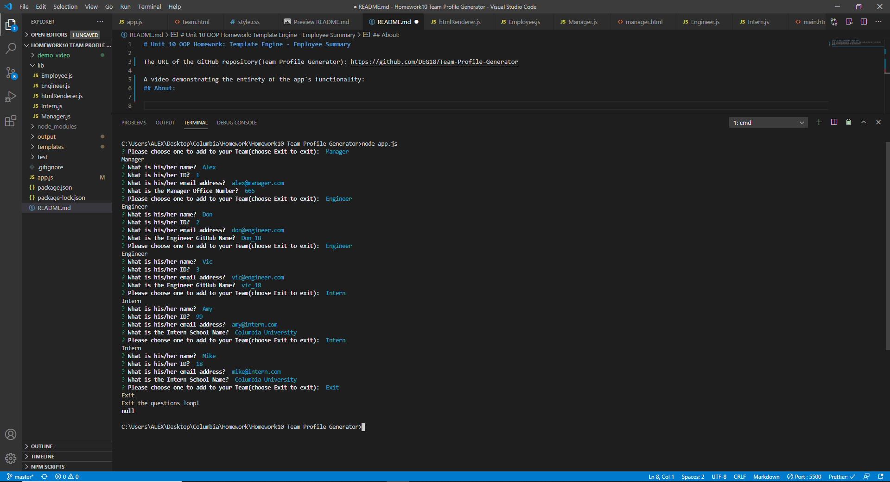
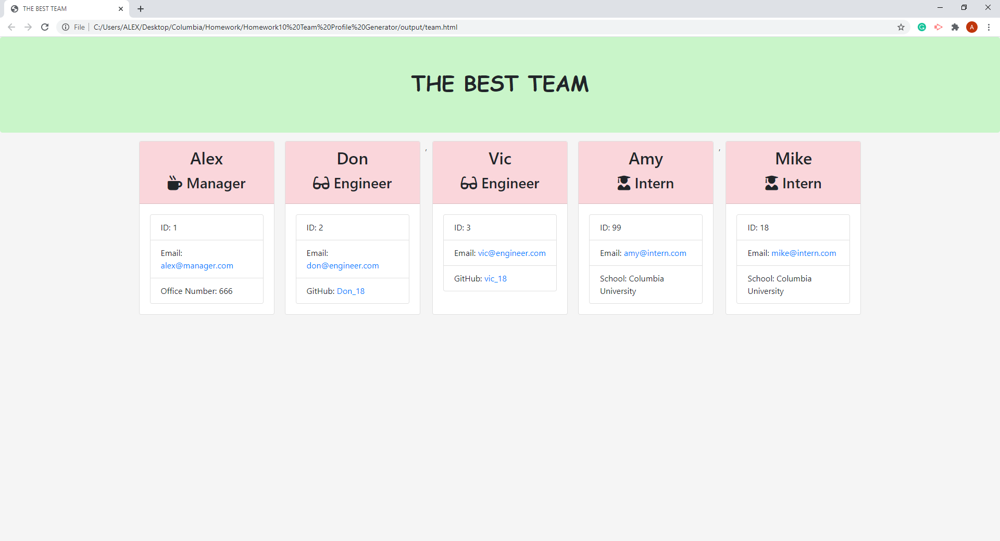

# Unit 10 OOP Homework: Template Engine - Employee Summary

The URL of the GitHub repository(Team Profile Generator): https://github.com/DEG18/Team-Profile-Generator

A video demonstrating the entirety of the app's functionality: https://youtu.be/of-ercxVxb4

## Input:

## Output:

## About:

This Team Profile Generator is using Node.js, user can input employee information through the terminal, and the employee choose by user will prompt the questions about the employee, then the computer will push the information of the employee to the right js file, after that will add to the team.html file, which is in the output folder.
